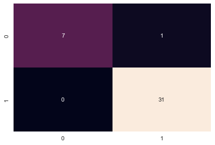
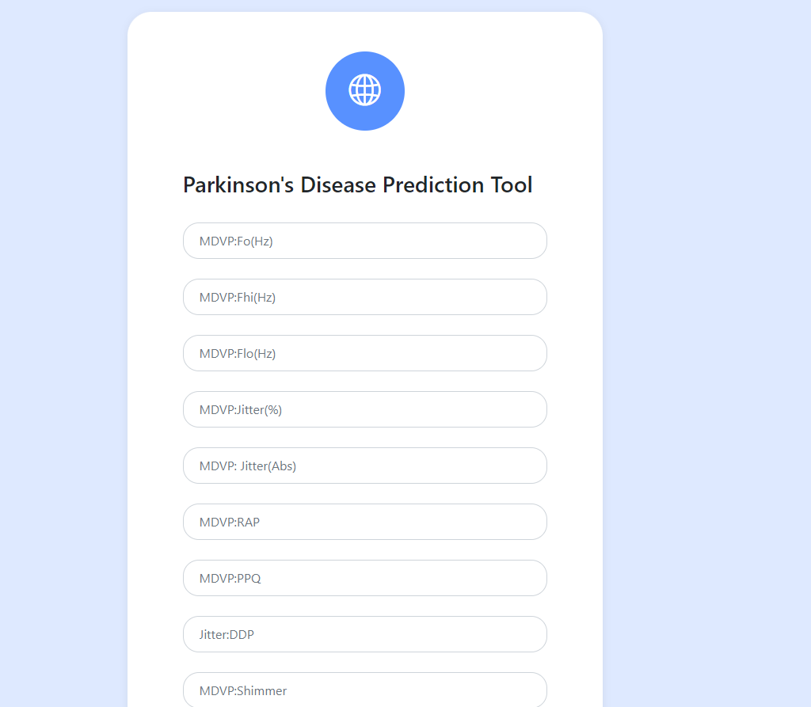

# Prediction of Parkinsons Disease using Data from Microphone Recordings: Project Overview

An application that allows users to predict the risk of a patient having parkisnsons based on data from microphone recordings

* Performed various Data Preprocessing techniques such as feature scaling and class balancing to clean and make the data ready for model building

* Random Forest, XGBoost and Support Vector Machines (SVM) were used to model the data

* Random Forest was the best with an accuracy of 97.44%, f1-score of 98.41% and recall of 100%

* Model was deployed on a web application built using **Django** available in the ```web-app/``` folder
___
## Model Performamce
Accuracy, F1-Score and Recall were the metrics used to evaluate the performance of the model

| Method    |  Accuracy (%)  | F1-Score (%) | Recall (%) |
|-----------|---------|-----------|---------|
| **Random Forest**   | **97.44**   | **98.41** | **100.00** |
| XGBoost | 89.74   | 93.94 | **100.00** |
| SVM | 89.74   | 93.33 | 90.32 |

Confusion Matrix
|   | 0  | 1  |
|---|----|----|
| 0 | TN | FP |
| 1 | FN | TP |
___

___
## Data Preprocessing
* Data was shuffled and split with a 80/20 ratio before preprocessing to avoid data leakage

* There was no missing values in the data, so no need for imputation

* Feature Scaling was applied using Standardization method

* Then the Class Imbalance was fixed from a 74:26 ratio to a 50:50 ratio

___
## Model Deployment
The final model with the best score was deployed on a web application built with **Django** with the frontend built with **HTML & CSS** with **Boostrap 4** as the CSS Framework.


___ 
